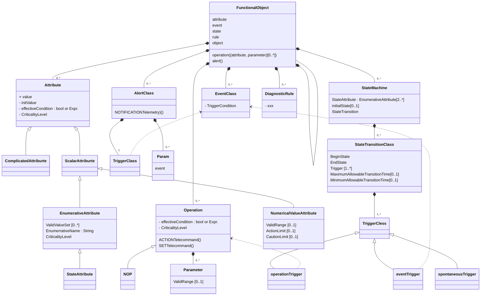

```mermaid
classDiagram
class FunctionalObject{
    attribute
    operation((attribute, parameter)[0..*])
    event
    state
    rule
    object
    alert()
}
class Attribute{
    + value
    - initValue
    - effectiveCondition : bool or Expr.
    - CriticalityLevel
}
class Operation{
    - effectiveCondition : bool or Expr.
    - CriticalityLevel
    ACTIONTelecommand()
    SETTelecommand()
}
class EventClass{
    - TriggerCondition
}
class AlertClass{
    NOTIFICATIONTelemetry)()
}
class StateMachine{
    StateAttribute : EnumerativeAttribute[2..*]
    initialState[0..1]
    StateTransition
}
class DiagnosticRule{
    - xxx
}
FunctionalObject *-- "0..*" FunctionalObject
FunctionalObject *-- "0..*" Attribute
FunctionalObject *-- "0..*" Operation
FunctionalObject *-- "0..*" EventClass
FunctionalObject *-- "0..*" AlertClass
FunctionalObject *-- "0..*" StateMachine
FunctionalObject *-- "0..*" DiagnosticRule
Attribute <|-- ComplicatedAttriburte
Attribute <|-- ScalarAttriburte
ScalarAttriburte <|-- EnumerativeAttribute
ScalarAttriburte <|-- NumericalValueAttribute
EnumerativeAttribute <|-- StateAttribute
class EnumerativeAttribute{
    ValidValueSet [0..*]
    EnumerrativeName : String
    CriticalityLevel
}
class NumericalValueAttribute{
    ValidRange [0..1]
    ActionLimit [0..1]
    CautionLimit [0..1]
}
Operation <|-- NOP 
Operation *-- "0..*" Parameter
class Parameter{
    ValidRange [0..1]
}
AlertClass *-- "1" TriggerClass
EventClass <.. TriggerClass
AlertClass *-- "0..*" Param
class Param{
    event
}
StateMachine *-- "0..*" StateTransitionClass
class StateTransitionClass{
    BeginState
    EndState
    Trigger [1..*]
    MaximumAllowableTransitionTime[0..1]
    MinimumAllowableTransitionTime[0..1]
}
StateTransitionClass *-- "1..*" TriggerCless
TriggerCless <|-- operationTrigger
TriggerCless <|-- eventTrigger
TriggerCless <|-- spontaneousTrigger
EventClass <.. eventTrigger
Operation <.. operationTrigger
```